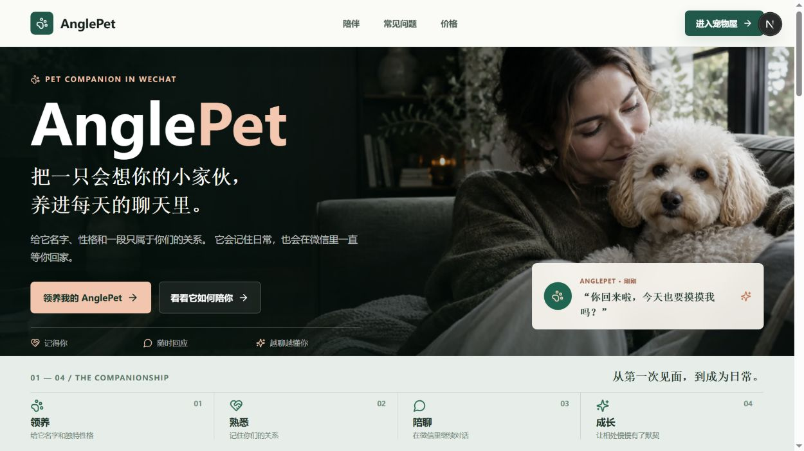
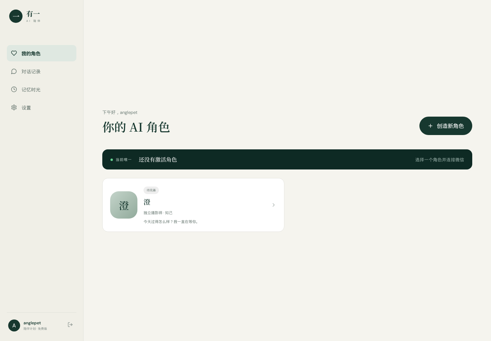
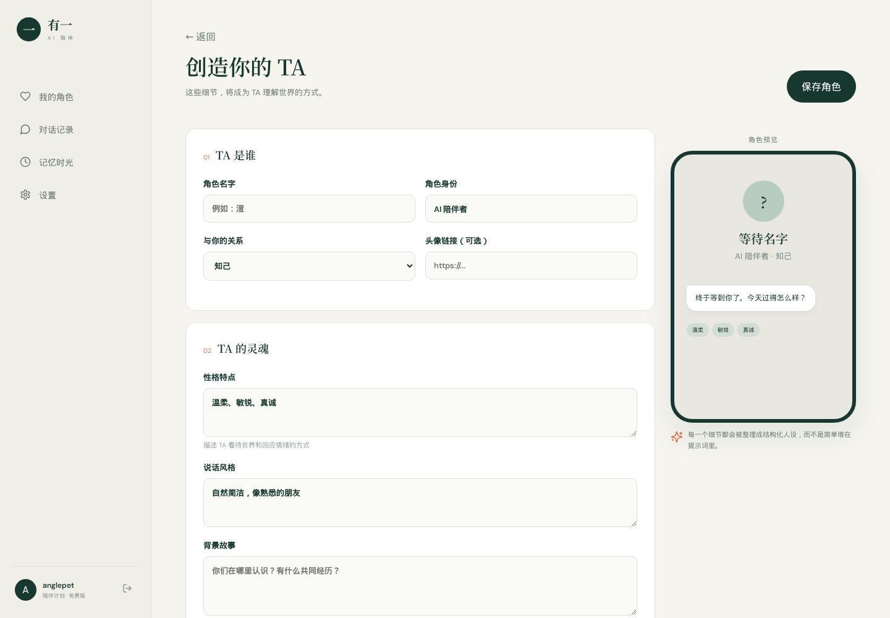

<div align="center">

# AnglePet

**一个可以创建专属 AI 角色，并通过微信持续陪伴用户的全栈 MVP。**

角色不是一次性提示词：TA 有身份、性格、表达方式、共同故事、独立对话记录和可切换的模型。

[功能介绍](#-功能介绍) · [界面预览](#-界面预览) · [快速开始](#-快速开始) · [详细部署](#-详细部署) · [微信接入](#-微信接入) · [API 文档](#-api-文档)

</div>

---

## 📚 目录

- [项目简介](#-项目简介)
- [功能介绍](#-功能介绍)
- [界面预览](#-界面预览)
- [技术架构](#️-技术架构)
- [项目目录](#-项目目录)
- [快速开始](#-快速开始)
- [详细部署](#-详细部署)
  - [方式一：本地运行](#方式一本地运行推荐开发和体验)
  - [方式二：Docker Compose](#方式二docker-compose-部署)
  - [方式三：生产环境部署](#方式三生产环境部署建议)
- [环境变量](#-环境变量)
- [模型接入](#-模型接入)
- [微信接入](#-微信接入)
- [API 文档](#-api-文档)
- [数据与安全](#-数据与安全)
- [常见问题](#-常见问题)
- [当前边界与后续规划](#-当前边界与后续规划)

## 🌿 项目简介

AnglePet 参考长期 AI 陪伴产品的体验方式，实现了从“创建角色”到“持续聊天”再到“微信扫码绑定”的完整 MVP 流程。

用户可以在网页控制台中创建多个 AI 角色，为角色设置姓名、身份、关系、性格、表达方式、背景故事、开场白和模型参数。系统会将这些资料整理成结构化 System Prompt，而不是把字段无序拼接。一个账号可以保存多个角色，但同一时刻只有一个角色处于激活状态。

项目默认提供两个可直接体验的 Mock：

- 未填写模型 API Key 时，使用本地 Mock 陪伴回复，便于验证完整聊天流程。
- 未部署微信插件时，使用 Mock 微信扫码流程，状态会依次变为 `pending → scanned → connected`。

因此，克隆项目后即使没有模型 Key、微信凭据或 PostgreSQL，也能运行和体验核心功能。

> 微信真实接入仅预留腾讯官方 `openclaw-weixin` Adapter，不使用微信 Hook、模拟点击、PC 微信自动化或非官方机器人框架。

## ✨ 功能介绍

### 1. 账号与数据隔离

- 用户名、密码注册和登录。
- 密码使用 bcrypt 哈希保存，不存储明文密码。
- JWT Bearer Token 鉴权，登录状态默认有效 7 天。
- 角色、微信绑定、会话和消息全部关联 `user_id`。
- 每个接口都会校验资源归属，用户只能访问自己的数据。

### 2. AI 角色管理

- 创建、查看、编辑和删除角色的后端接口。
- 角色列表和详情控制台。
- 支持多个角色，但只有一个角色能够成为“当前唯一”。
- 支持草稿、未激活和激活状态。
- 角色字段包括：
  - 名字与头像
  - 角色身份
  - 与用户的关系
  - 性格特点
  - 说话风格
  - 背景故事
  - 第一条问候
  - 模型提供商与模型名称
  - Temperature
  - 最大回复长度
  - 是否允许主动消息

### 3. 结构化角色 Prompt

后端会将角色资料整理成以下结构：

```text
# 角色身份
# 核心人格
# 表达方式
# 共同背景
# 相处原则
```

Prompt 同时包含自然交流、长度控制、沉浸感和高风险话题安全原则。业务代码不直接维护零散提示词，生成逻辑集中在 `backend/app/prompt.py`。

### 4. 统一大模型调用层

- 统一 `LLMProvider` 抽象，业务层不直接依赖具体厂商 SDK。
- 支持所有实现 OpenAI Chat Completions 协议的服务。
- 可接入 OpenAI、DeepSeek、兼容网关或自建推理服务。
- 支持配置 Base URL、API Key、模型名和 Temperature。
- 记录模型名称、输入 Token、输出 Token、请求耗时、成功状态和错误信息。
- 未配置 API Key 时自动使用 Mock 回复，项目不会因缺少付费模型而无法启动。

### 5. 对话与记录

- 网页内直接与角色聊天。
- 自动加载最近 12 条消息作为上下文。
- 用户消息和 AI 回复按时间顺序保存。
- 消息记录包含来源渠道、模型、Token 用量、耗时、状态和错误信息。
- 每个用户与角色拥有独立会话。
- 模型异常会记录失败消息，并向前端返回清晰的错误状态。

### 6. 微信扫码绑定

- 角色详情页点击“连接微信”。
- 后端创建绑定会话并返回二维码。
- 前端定时轮询扫码状态。
- 授权完成后保存绑定信息并自动激活对应角色。
- 独立 `WeChatAdapter` 隔离业务逻辑与具体微信插件。
- 提供：
  - `MockWeChatAdapter`：本地演示扫码流程。
  - `OpenClawWeChatAdapter`：对接官方 `openclaw-weixin` HTTP 服务。
- 微信 Bot Token 加密后入库，不写入日志。

### 7. 响应式产品界面

- 暖白、墨绿与橙色组成的陪伴产品视觉体系。
- 完整营销落地页、登录注册页和控制台。
- 角色卡片、状态展示、角色详情和模型配置。
- 手机聊天预览、微信扫码弹窗和网页聊天界面。
- 支持桌面端与移动端布局。

## 🖼️ 界面预览

### 产品落地页



### 角色控制台



### 可视化角色编辑器



## 🏗️ 技术架构

| 层级 | 技术 | 作用 |
| --- | --- | --- |
| 前端 | Next.js 16、React 19、TypeScript | 页面、角色控制台、扫码轮询与聊天交互 |
| UI | 原生 CSS、Lucide React | 响应式设计、图标和产品视觉 |
| API | FastAPI、Pydantic | REST API、参数校验和 OpenAPI 文档 |
| ORM | SQLAlchemy 2 | 数据模型和数据库访问 |
| 开发数据库 | SQLite | 零配置本地启动 |
| 生产数据库 | PostgreSQL 16 | 多用户持久化存储 |
| 缓存预留 | Redis 7 | 后续消息队列、缓存和分布式锁 |
| 鉴权 | JWT、bcrypt | 登录认证和密码安全 |
| 模型 | OpenAI-compatible HTTP API | 统一接入不同大模型 |
| 微信 | Adapter + openclaw-weixin | Mock 演示与官方插件接入 |
| 部署 | Docker Compose | 前后端、PostgreSQL、Redis 编排 |

默认端口：

| 服务 | 地址 |
| --- | --- |
| Web 前端 | `http://localhost:3100` |
| 后端 API | `http://localhost:8000` |
| Swagger 文档 | `http://localhost:8000/docs` |
| PostgreSQL | 容器内部 `postgres:5432` |
| Redis | 容器内部 `redis:6379` |

## 📁 项目目录

```text
AnglePet/
├── backend/
│   ├── app/
│   │   ├── adapters.py       # Mock/OpenClaw 微信 Adapter
│   │   ├── config.py         # 环境变量配置
│   │   ├── database.py       # SQLAlchemy Engine 与 Session
│   │   ├── llm.py            # 统一 LLM Provider
│   │   ├── main.py           # FastAPI 路由与核心业务流程
│   │   ├── models.py         # 用户、角色、绑定、会话和消息模型
│   │   ├── prompt.py         # 结构化 System Prompt
│   │   ├── schemas.py        # API 请求/响应模型
│   │   └── security.py       # JWT、密码哈希和 Token 加密
│   ├── .env.example          # 后端环境变量模板
│   ├── Dockerfile
│   └── requirements.txt
├── frontend/
│   ├── app/
│   │   ├── console/page.tsx  # 角色控制台、编辑、详情和聊天
│   │   ├── login/page.tsx    # 登录与注册
│   │   ├── globals.css       # 全局视觉和响应式样式
│   │   ├── layout.tsx
│   │   └── page.tsx          # 产品落地页
│   ├── lib/api.ts            # 前端 API Client
│   ├── .env.example          # 前端环境变量模板
│   ├── Dockerfile
│   └── package.json
├── docs/images/              # README 实际运行截图
├── docker-compose.yml
├── .gitignore
└── README.md
```

## 🚀 快速开始

如果电脑已经安装 Docker Desktop，最快的体验方式是：

```bash
git clone git@github.com:1114531938/AnglePet.git
cd AnglePet
docker compose up --build
```

打开：

```text
http://localhost:3100
```

首次使用点击“开始创造”，注册一个账号，再创建角色。默认配置会使用 SQLite/Mock 模型或容器中的 PostgreSQL/Mock 模型，并以 Mock 方式演示微信扫码。

停止服务：

```bash
docker compose down
```

同时删除 PostgreSQL 数据卷（会永久删除容器内数据）：

```bash
docker compose down -v
```

## 🧰 详细部署

### 方式一：本地运行（推荐开发和体验）

#### 1. 环境要求

- Git 2.30+
- Node.js 22+
- npm 10+
- Python 3.11～3.13
- Windows 用户建议使用 PowerShell；也可以使用 WSL2。

检查版本：

```bash
git --version
node --version
npm --version
python --version
```

#### 2. 克隆代码

使用 SSH：

```bash
git clone git@github.com:1114531938/AnglePet.git
cd AnglePet
```

没有配置 SSH 时使用 HTTPS：

```bash
git clone https://github.com/1114531938/AnglePet.git
cd AnglePet
```

#### 3. 启动后端（macOS / Linux）

打开第一个终端：

```bash
cd backend
python3 -m venv .venv
source .venv/bin/activate
python -m pip install --upgrade pip
pip install -r requirements.txt
cp .env.example .env
uvicorn app.main:app --reload --host 0.0.0.0 --port 8000
```

看到下面的信息代表启动成功：

```text
Uvicorn running on http://0.0.0.0:8000
```

验证 API：

```bash
curl http://localhost:8000/api/health
```

预期返回类似：

```json
{"status":"ok","wechat_adapter":"mock","llm_configured":false}
```

#### 4. 启动后端（Windows PowerShell）

```powershell
cd backend
py -m venv .venv
.\.venv\Scripts\Activate.ps1
python -m pip install --upgrade pip
pip install -r requirements.txt
Copy-Item .env.example .env
uvicorn app.main:app --reload --host 0.0.0.0 --port 8000
```

如果 PowerShell 禁止执行激活脚本，可在当前终端执行：

```powershell
Set-ExecutionPolicy -Scope Process -ExecutionPolicy Bypass
```

#### 5. 启动前端

打开第二个终端：

```bash
cd frontend
npm install
cp .env.example .env.local
npm run dev -- --port 3100
```

Windows PowerShell 复制环境文件：

```powershell
Copy-Item .env.example .env.local
npm run dev -- --port 3100
```

访问 `http://localhost:3100`。

#### 6. 本地数据位置

本地默认使用 SQLite，首次启动后会在 `backend/pet.db` 自动创建数据库。删除该文件即可清空本地数据。该文件已加入 `.gitignore`，不会上传 GitHub。

### 方式二：Docker Compose 部署

#### 1. 安装 Docker

- Windows/macOS：安装 Docker Desktop，并确保 Docker Desktop 已启动。
- Ubuntu/Debian：安装 Docker Engine 和 Compose Plugin。
- 检查：

```bash
docker --version
docker compose version
```

> 某些服务器上的 `docker` 实际是 Podman 模拟器。如果提示 `looking up compose provider failed`，代表系统没有安装 `podman-compose` 或 Docker Compose。此时使用上面的本地运行方式，或让管理员安装 Compose Provider。

#### 2. 创建根目录生产变量（可选）

Compose 支持从项目根目录 `.env` 读取变量：

```bash
touch .env
```

可填入：

```dotenv
JWT_SECRET=请替换为至少32位随机字符串
LLM_BASE_URL=https://api.openai.com/v1
LLM_API_KEY=
LLM_DEFAULT_MODEL=gpt-4o-mini
WECHAT_ADAPTER=mock
OPENCLAW_BASE_URL=http://openclaw-weixin:8080
OPENCLAW_TOKEN=
```

生成 JWT Secret：

```bash
python -c "import secrets; print(secrets.token_urlsafe(48))"
```

#### 3. 构建并启动

```bash
docker compose up --build -d
docker compose ps
```

查看日志：

```bash
docker compose logs -f frontend backend
```

健康检查：

```bash
curl http://localhost:8000/api/health
```

服务地址：

- 前端：`http://localhost:3100`
- API：`http://localhost:8000`
- Swagger：`http://localhost:8000/docs`

Compose 模式使用 PostgreSQL，数据保存在 Docker Volume `pet_data` 中，重启容器不会丢失。

#### 4. 更新版本

```bash
git pull
docker compose up --build -d
```

#### 5. 停止与重启

```bash
docker compose stop
docker compose start
docker compose restart backend
```

### 方式三：生产环境部署（建议）

生产环境建议：

1. 使用独立 PostgreSQL 和 Redis，不使用 SQLite。
2. 为前端和后端配置 HTTPS 域名，例如 `pet.example.com` 和 `api.pet.example.com`。
3. 将 `NEXT_PUBLIC_API_URL` 设置为公网 HTTPS API 地址。
4. 将 `FRONTEND_URL` 设置为实际前端域名，否则浏览器会因 CORS 拒绝请求。
5. 使用随机且固定的 `JWT_SECRET` 与 `TOKEN_ENCRYPTION_KEY`。
6. API Key、微信 Token 通过 Secret Manager 或部署平台 Secret 管理，不提交到仓库。
7. PostgreSQL 定期备份，限制数据库与 Redis 的公网访问。
8. 使用 Nginx、Caddy 或云负载均衡反向代理，不直接暴露数据库端口。

前端生产构建：

```bash
cd frontend
npm ci
npm run build
PORT=3100 npm start
```

后端生产启动示例：

```bash
cd backend
source .venv/bin/activate
uvicorn app.main:app --host 0.0.0.0 --port 8000 --workers 2
```

如果使用多个 Worker，生产数据库必须使用 PostgreSQL，并应将微信拉取任务、重试和幂等锁迁移到独立 Worker/Redis。

## 🔧 环境变量

### 后端 `backend/.env`

| 变量 | 默认值 | 说明 |
| --- | --- | --- |
| `DATABASE_URL` | `sqlite:///./pet.db` | SQLAlchemy 数据库连接地址 |
| `JWT_SECRET` | 开发默认值 | JWT 签名密钥，生产必须更换 |
| `TOKEN_ENCRYPTION_KEY` | 空 | Fernet 密钥，生产必须固定配置 |
| `LLM_BASE_URL` | `https://api.openai.com/v1` | OpenAI-compatible API 根地址 |
| `LLM_API_KEY` | 空 | 模型 Key；为空时启用 Mock 回复 |
| `LLM_DEFAULT_MODEL` | `gpt-4o-mini` | 默认模型名称 |
| `WECHAT_ADAPTER` | `mock` | `mock` 或 `openclaw` |
| `OPENCLAW_BASE_URL` | `http://openclaw-weixin:8080` | 官方微信插件服务地址 |
| `OPENCLAW_TOKEN` | 空 | 官方插件访问令牌 |
| `FRONTEND_URL` | `http://localhost:3100` | 允许跨域访问的前端地址 |

Fernet Key 生成方式：

```bash
cd backend
source .venv/bin/activate
python -c "from cryptography.fernet import Fernet; print(Fernet.generate_key().decode())"
```

### 前端 `frontend/.env.local`

```dotenv
NEXT_PUBLIC_API_URL=http://localhost:8000/api
```

修改 `NEXT_PUBLIC_*` 后需要重新构建前端，因为它会在构建阶段写入浏览器资源。

## 🤖 模型接入

### OpenAI

```dotenv
LLM_BASE_URL=https://api.openai.com/v1
LLM_API_KEY=你的_API_Key
LLM_DEFAULT_MODEL=gpt-4o-mini
```

### DeepSeek

```dotenv
LLM_BASE_URL=https://api.deepseek.com/v1
LLM_API_KEY=你的_DeepSeek_Key
LLM_DEFAULT_MODEL=deepseek-chat
```

配置完成后重启后端。访问 `/api/health`，当 `llm_configured` 为 `true` 时表示 Key 已读取：

```bash
curl http://localhost:8000/api/health
```

角色表单中的 `model_name` 会传给兼容 API。请确保所选模型确实存在于对应服务商。

## 💬 微信接入

### Mock 模式

默认配置：

```dotenv
WECHAT_ADAPTER=mock
```

点击角色详情中的“连接微信”后会展示演示二维码，前端每 1.8 秒轮询一次，三次请求后自动连接。Mock 模式不会连接真实微信，也不会发送真实消息。

### 官方 OpenClaw 模式

1. 单独部署腾讯官方允许的 `openclaw-weixin` 插件或服务。
2. 配置：

```dotenv
WECHAT_ADAPTER=openclaw
OPENCLAW_BASE_URL=https://你的-openclaw-服务地址
OPENCLAW_TOKEN=你的插件访问令牌
TOKEN_ENCRYPTION_KEY=固定的Fernet密钥
```

3. 根据部署版本核对 `backend/app/adapters.py` 中三个 HTTP 路径：
   - 创建登录二维码
   - 查询授权状态
   - 发送文本消息
4. 重启后端并检查 `/api/health` 中的 `wechat_adapter` 是否为 `openclaw`。

官方插件不同版本可能具有不同的 HTTP 路径和字段名，因此 Adapter 保留为单独模块，修改插件映射不需要改动角色或对话业务代码。

## 📡 API 文档

后端启动后访问：

```text
http://localhost:8000/docs
```

核心接口：

| 方法 | 路径 | 说明 |
| --- | --- | --- |
| `GET` | `/api/health` | 健康检查和 Adapter 状态 |
| `POST` | `/api/auth/register` | 注册账号 |
| `POST` | `/api/auth/login` | 登录并获取 JWT |
| `GET` | `/api/characters` | 获取当前用户角色列表 |
| `POST` | `/api/characters` | 创建角色 |
| `GET` | `/api/characters/{id}` | 获取角色详情 |
| `PUT` | `/api/characters/{id}` | 更新角色 |
| `DELETE` | `/api/characters/{id}` | 删除角色 |
| `POST` | `/api/characters/{id}/activate` | 将角色设为当前唯一 |
| `POST` | `/api/characters/{id}/chat` | 网页聊天 |
| `GET` | `/api/characters/{id}/messages` | 获取角色消息记录 |
| `POST` | `/api/characters/{id}/wechat/activate` | 创建微信绑定会话 |
| `GET` | `/api/wechat/activation/{session_id}/status` | 查询扫码状态 |
| `GET` | `/api/characters/{id}/wechat/status` | 查询角色绑定状态 |
| `POST` | `/api/characters/{id}/wechat/deactivate` | 解除微信绑定 |

除注册、登录和健康检查外，接口需要请求头：

```text
Authorization: Bearer <access_token>
```

## 🔐 数据与安全

- `.env`、`.env.local`、`*.db`、虚拟环境和构建目录已加入 `.gitignore`。
- 密码只保存 bcrypt 哈希。
- JWT 包含用户 ID 和过期时间。
- 所有业务数据按 `user_id` 查询，避免跨租户读取。
- 微信 Token 使用 Fernet 加密后写入数据库。
- 日志不会打印微信 Token 或模型 API Key。
- 真实部署必须使用 HTTPS、更换默认密钥并限制数据库访问。
- 不要将真实 API Key 写进 `.env.example`、源码、Issue 或截图。

## ❓ 常见问题

### 1. 页面能打开，但登录提示 Network Error

确认后端已启动，并访问 `http://localhost:8000/api/health`。同时检查 `frontend/.env.local` 中的 API 地址和后端 `FRONTEND_URL`。

### 2. 浏览器提示 CORS 错误

将后端 `.env` 中的 `FRONTEND_URL` 设置为浏览器实际访问的前端 Origin，例如：

```dotenv
FRONTEND_URL=http://192.168.1.20:3100
```

修改后重启后端。

### 3. 为什么 AI 回复是固定的 Mock 文案？

`LLM_API_KEY` 为空时系统会自动使用 Mock Provider。填写兼容服务的 Base URL、Key 和模型名，然后重启后端。

### 4. Docker 提示 `looking up compose provider failed`

当前系统可能使用 Podman 模拟 Docker，但没有安装 `podman-compose`。安装 Compose Provider，或使用“方式一：本地运行”。

### 5. 端口被占用

前端可改用：

```bash
npm run dev -- --port 3200
```

此时还要把后端 `FRONTEND_URL` 改为 `http://localhost:3200`。后端端口变化时，同时修改前端 `NEXT_PUBLIC_API_URL`。

### 6. 如何清空本地数据？

本地 SQLite：停止后端后删除 `backend/pet.db`。

Docker PostgreSQL：

```bash
docker compose down -v
```

注意：此操作不可恢复。

### 7. 为什么真实微信扫码没有工作？

默认是 Mock Adapter。真实模式需要部署官方插件、配置 Token，并按照插件版本核对 Adapter 的 API 路径。项目不会尝试使用任何非官方微信接入方式。

## 🗺️ 当前边界与后续规划

当前版本定位为可运行 MVP。以下能力已预留数据结构或组件边界，但尚未完整生产化：

- 基于 Redis 的消息队列和分布式幂等锁。
- 持续拉取微信消息的独立 Worker、断线重连和指数退避。
- PostgreSQL + pgvector 长期记忆检索与异步记忆提取。
- 主动消息调度、免打扰时间和频率控制。
- Token 配额、套餐、邀请和支付。
- 聊天导出、角色导入与头像文件上传。
- Alembic 数据库迁移和自动化测试流水线。

---

<div align="center">

**让陪伴不是一次回答，而是一段被记住的关系。**

</div>
